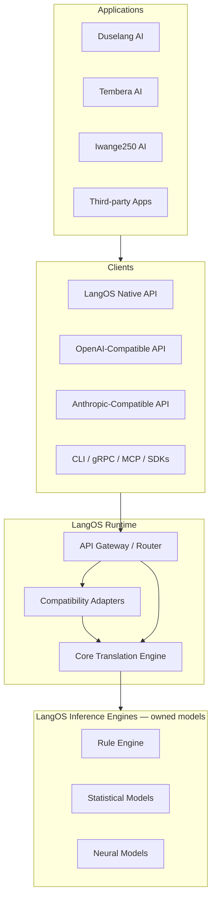

# LangOS Architecture Document

**Version:** 0.1.0  
**Status:** Draft — foundation for development  
**Last updated:** 2026-07-23

---

## 1. Executive Summary

LangOS (Language Operating System) is a **domain-agnostic language infrastructure** that sits between humans and intelligent applications. It translates human language into structured meaning and back again. It does **not** reason, decide, execute actions, or hold business logic.

```
Human  ⇄  LangOS  ⇄  Application / Reasoning AI
         (language)      (domain + logic)
```

Every product—Duselang, Tembera, Iwange250, livestock systems, healthcare, third-party apps—shares the same language engine while keeping its own reasoning engine.

LangOS is **built entirely to perform language translation**. It must understand anything a human can write—from a single command to a multi-page report—and express anything a reasoning AI (like Duselang) needs to communicate back to a human. All understanding and generation runs on **LangOS-owned models and pipelines**. LangOS does **not** delegate comprehension or expression to OpenAI, Anthropic, or other third-party language APIs.

For migration, LangOS exposes **API-compatible surfaces** (OpenAI-compatible, Anthropic-compatible) so applications that previously called those vendors for language work can point at LangOS instead—**without changing client code**.

LangOS is architected like a **compiler with an operating system kernel**, not like a chatbot:

```
Human Language  →  Lexical Analysis  →  Syntactic Analysis  →  Semantic Analysis  →  Semantic IR
Semantic IR     →  Sentence Planner  →  Grammar Generator   →  Natural Language
```

---

## 2. Design Principles

These principles are non-negotiable and govern every design decision.

| # | Principle | Implication |
|---|-----------|-------------|
| P1 | **Translate, never reason** | LangOS extracts meaning and generates language. Applications decide what to do with it. |
| P2 | **Domain neutrality** | LangOS does not know what a student, bus, or invoice *means*. It extracts labels and relationships from text. |
| P3 | **Statelessness** | LangOS holds no conversation memory. Applications send context with every request. |
| P4 | **Language independence via Semantic IR** | All human languages compile to the same intermediate representation. |
| P5 | **Self-contained translation** | All understanding and generation is performed by LangOS engines and models. No runtime dependency on external language APIs. |
| P6 | **API compatibility for migration** | OpenAI-compatible and Anthropic-compatible endpoints let existing clients switch to LangOS by changing base URL and credentials only. |
| P7 | **Transport independence** | Native API, OpenAI-compat, Anthropic-compat, CLI, gRPC, and MCP are clients of one core runtime—not separate implementations. |
| P8 | **Progressive complexity** | Simple commands use fast rule-based paths; ambiguous or long text uses LangOS neural engines. |
| P9 | **Graph-first internals, JSON exports** | Semantic Graph is the native structure; JSON is the application-facing export format. |
| P10 | **Universal input/output** | Any human text in, any structured meaning out; any structured meaning in, any natural language out—at any length. |

---

## 3. System Context



**Important:** OpenAI and Anthropic appear only as **API shapes** that LangOS implements for client compatibility. LangOS never forwards requests to those vendors for language understanding or generation.

### 3.1 Responsibility Boundaries

**LangOS is responsible for:**

- Language detection
- Tokenization and parsing
- Entity and relationship extraction
- Coreference marking (`she`, `it`, `that class`)
- Semantic unit segmentation (sentences → meaning units)
- Building Semantic IR / Semantic Graph
- Natural language generation from structured input
- Multilingual normalization to Semantic IR
- Confidence scoring for extractions

**LangOS is NOT responsible for:**

- Business rules (required fields, permissions, validation)
- Executing actions (create student, book ticket)
- Conversation policy (when to ask follow-up questions)
- Domain ontology (what entities exist in a school system)
- Storing application state

---

## 4. Core Abstractions

### 4.1 Semantic IR (Intermediate Representation)

The Semantic IR is LangOS's native language—the equivalent of LLVM IR in a compiler. Every human language pack produces and consumes this representation.

**v1.2** — the current schema. The graph is the meaning. JSON is serialization.

Key design decisions:
- **Everything is a node** — predicates, concepts, and references are all graph nodes
- **Relationships are edges** — Node → Edge → Node, no special cases
- **Concepts are separate from mentions** — one concept can have many surface occurrences
- **Stable vocabulary IDs** — applications depend on `ACT_000005`, never on symbols or surface verbs
- **Spans live on mentions, not nodes** — a concept has no position; a mention does

```json
{
  "version": "1.2",
  "source": { "language": "en", "text": "Register Clarissa in Biology A1." },
  "graph": {
    "nodes": [
      {
        "id": "p_f3e809c555ebf8ba",
        "type": "predicate",
        "predicate": { "id": "ACT_000005", "symbol": "ACTION_REGISTER" }
      },
      {
        "id": "c_f9f24809d2affb3c",
        "type": "concept",
        "concept": { "canonical": "clarissa", "kind": "named" }
      },
      {
        "id": "c_11768320e30905f1",
        "type": "concept",
        "concept": { "canonical": "biology a1", "kind": "named" }
      }
    ],
    "edges": [
      { "from": "p_f3e809c555ebf8ba", "to": "c_f9f24809d2affb3c", "role": "patient" },
      { "from": "p_f3e809c555ebf8ba", "to": "c_11768320e30905f1", "role": "container" }
    ]
  },
  "mentions": [
    { "node_id": "c_f9f24809d2affb3c", "surface": "Clarissa", "span": [9, 17] },
    { "node_id": "c_11768320e30905f1", "surface": "Biology A1", "span": [21, 31] }
  ],
  "utterance_type": "command",
  "confidence": { "overall": 0.97, "predicate": 0.99, "roles": 0.95, "references": 1.0 },
  "meta": {
    "detected_language": "en",
    "engine": { "parser": "rule", "language_pack": "en", "version": "1.0.0" }
  }
}
```

#### IR Design Rules

1. **Everything is a node** — predicates (`ACT_000005`), concepts (`clarissa`), and references (`REF_SPEAKER`) are all nodes in the same graph. No special data structures.
2. **Relationships are edges** — `{ from: predicate, to: concept, role: "patient" }`. Every semantic relationship follows Node → Edge → Node. No arrays of participants.
3. **Vocabulary IDs are stable contracts** — applications depend on `ACT_000005`, never on the symbol `ACTION_REGISTER` or the surface verb "register". Symbols exist for readability and debugging only.
4. **Concepts are separate from mentions** — "Clarissa", "She", and "The student" are three mentions of one concept. Concepts have `canonical` and `kind`. Mentions have `surface` and `span`.
5. **Semantic roles follow linguistics** — `patient` (entity being acted upon), `agent` (deliberate performer), `theme` (entity described), `experiencer` (mental state holder), `container` (receiving group).
6. **References are nodes, not strings** — `REF_SPEAKER`, `REF_LISTENER`, `REF_PREVIOUS_ENTITY` are reference nodes in the graph. "me" at span [12,14] is a mention of the REF_SPEAKER node.
7. **Utterance type is top-level** — `command`, `question`, `statement`, `exclamation`, `fragment`. Part of the IR, not application logic.
8. **Confidence is per-component** — applications know exactly what LangOS is uncertain about.
9. **IDs are deterministic hashes** — stable across invocations. The same concept produces the same ID every time.

### 4.2 Semantic Graph

The Semantic Graph is the **heart** of LangOS. Everything is a node. Relationships are edges. JSON is serialization.

```
Three node types:

  Predicate    — an action, state, or query (ACT_000005, QRY_000001)
  Concept      — a thing in the world (clarissa, biology a1, 15)
  Reference    — a pronoun or deictic (REF_SPEAKER, REF_LISTENER)

Every relationship:

  Node  →  Edge (role)  →  Node
```

Example: "Register Clarissa in Biology A1"

```
     ┌──── patient ────┐
     │                  │
  [predicate]        [concept]
  ACT_000005         clarissa
  ACTION_REGISTER    kind: named
     │
     └── container ──── [concept]
                        biology a1
                        kind: named
```

Example: "Do you know me?"

```
     ┌── experiencer ── [reference]
     │                   REF_LISTENER
  [predicate]            mention: "you" [3,6]
  QRY_000001
  QUERY_KNOW
     │
     └── theme ──────── [reference]
                         REF_SPEAKER
                         mention: "me" [12,14]
```

Every parser, language pack, and future model reads from and writes to the graph. JSON is the external contract. Multiple export profiles can exist.

### 4.3 Semantic Vocabulary

The Semantic Vocabulary is LangOS's **system call table**. A finite set of **436 primitive** semantic actions, states, queries, events, relations, modifiers, and conversational acts that all human language maps to. IDs are append-only: they never change and are never reused.

```
Category  Count  Range
ACT       220    actions: create, register, speak, walk, heal, ...
STA        60    states: be, know, love, need, own, resemble, ...
QRY        30    queries: what, who, how many, how long, whose, ...
EVT        40    events: join, complete, crash, rain, graduation, ...
REL        30    relations: part_of, caused_by, member_of, married_to, ...
MOD        30    modifiers: negation, tense, politeness, urgency, ...
META       25    conversational: greet, thank, apologize, encourage, ...
UNK         1    fallback
```

Every language pack maps its verbs and idioms onto these primitives:

```
English:      register, enroll, sign up   →  ACT_000005
French:       inscrire, enregistrer       →  ACT_000005
Kinyarwanda:  kwandikisha, andikisha      →  ACT_000005
Turkish:      kaydetmek, kaydolmak        →  ACT_000005
```

Applications depend on `ACT_000005`. The vocabulary is the most stable component of LangOS. Human languages evolve; the vocabulary remains.

### 4.4 Lexicon — every word, minimum lookup time

The vocabulary stays small; the **lexicon** grows huge. The English lexicon
(`packs/en/lexicon.json`, generated by `python/langos_train`) contains **5,698 entries**:
every primitive's base word, curated synonyms, all English inflections
(register → registers, registered, registering; know → knew, known), pronouns,
and multi-word idioms ("sign up", "by the way", "thank you").

The lookup algorithm (`LangOS.Lexicon`):

1. **Load once** into `:persistent_term` — lock-free, zero-copy reads shared by every process.
2. **Single word lookup**: one hash-map fetch — **O(1)**, independent of lexicon size.
3. **Sentence annotation**: greedy longest-match scan. At each token, try the longest
   phrase window first (bounded by the longest phrase in the lexicon, k ≤ 5 words),
   so "sign up" beats "sign". Complexity **O(n · k)** for n tokens — linear in
   text length, independent of how many entries the lexicon holds.

### 4.5 Structural understanding — the Syntax engine

Understanding is **structure extraction, not intent classification**. The
primary parser (`LangOS.Engine.Syntax`) runs six deterministic stages:

```
Input Text
    │
    ▼
Language Detection      every installed pack competes (verb maps, pronouns,
    │                   function words, morphological prefix stripping)
    ▼
Tokenizer               words with byte spans
    │
    ▼
Morphological Analyzer  inflected form → lemma entry ("registered" → register,
    │                   Kinyarwanda "nshaka" → n- (speaker) + shaka)
    ▼
Dependency Parser       question markers, main verb, subject, objects,
    │                   prepositional attachments
    ▼
Semantic Mapper         verb lemma → vocabulary ID; the ONLY stage that
    │                   knows the Semantic Vocabulary
    ▼
Semantic Graph Builder  nodes + role edges + mentions → IR v1.2
```

Key invariants:

- **Question-ness is `utterance_type`, never a predicate.** "What is the
  meaning of photosynthesis?" parses as `question` + `ACT_000221
  ACTION_DEFINE` with theme `photosynthesis` — the phrase "what is the
  meaning of" is linguistic form, not meaning.
- **No argument is dropped.** "Can I join the class?" yields
  `EVENT_JOIN(patient: REF_SPEAKER, container: class)` — subject and object
  both become role edges.
- **Roles come from the vocabulary.** Each primitive declares its role
  signature (`EVENT_JOIN: [patient, container, time]`); the parser assigns
  subject/object/prepositional phrases to those declared roles.
- **Every stage before the Semantic Mapper works purely with language**, so
  the same pipeline serves English, French, Kinyarwanda, and future packs.
  Packs declare their own detection words, verb maps, and morphological
  prefixes (`packs/<id>/patterns/commands.json`).

### 4.6 Trained understanding — the Stat engine (fallback)

`python/langos_train` builds LangOS's own model. No external APIs.

```
seed synonyms + templates ──► corpus generator ──► 41,000+ labeled utterances
                                                        │
                                                        ▼
                              multinomial Naive Bayes (unigram + bigram features,
                              uniform priors, shared-vocabulary Laplace smoothing)
                                                        │
                                                        ▼
                              models/en/intent.json — 360 intent classes
```

At runtime `LangOS.Engine.Stat` scores every class and computes confidence as
**top-1 vs top-2 margin × feature hit rate** — gibberish scores 0.0 because the
winning class recognizes none of its features. Below the confidence threshold
(config `engines.stat.min_confidence`, default 0.3) the parse is rejected and
the pipeline falls through to the next engine.

The parse chain: **rule → syntax → stat → neural**. Precise patterns first,
then the deterministic structural parser, with the trained classifier and
bootstrap heuristics only as fallbacks for verbless or idiomatic utterances
("thank you so much"). Statistical classification is disappearing from the
main path by design. Retraining is one command: `python3 -m langos_train.build`.

### 4.3 Language Packs

Language packs are plugins that know one human language. The kernel never imports language-specific logic.

```
Language Pack = Tokenizer + Parser + Semantic Mapper + Generator
```

Each pack implements two directions:

- **Inbound:** Human text → Semantic IR
- **Outbound:** Semantic IR → Human text (respecting target locale and register)

Supported launch languages (Phase 1 target):

| Pack | Priority |
|------|----------|
| English (`en`) | P0 |
| French (`fr`) | P1 |
| Kinyarwanda (`rw`) | P1 |
| Turkish (`tr`) | P2 |

Adding a language pack does not require kernel changes.

### 4.4 Vocabulary Plugins (Domain Hints)

Vocabulary plugins improve recognition of domain terms without embedding domain logic:

```
Patience install language education-vocab
Patience install language transport-vocab
Patience install language livestock-vocab
```

A vocabulary plugin contributes:

- Term lexicons (synonyms, abbreviations)
- Entity label hints (`"A1"` likely a class identifier)
- Disambiguation priors

Vocabulary plugins **do not** define intents, business rules, or actions.

---

## 5. Runtime Architecture

### 5.1 Layer Model

```
┌─────────────────────────────────────────────────────────────┐
│  Transport Layer     Native API · OpenAI-compat · Anthropic │
│                      · CLI · gRPC · MCP · SDK               │
├─────────────────────────────────────────────────────────────┤
│  Compatibility Layer  OpenAI / Anthropic request adapters   │
├─────────────────────────────────────────────────────────────┤
│  Gateway Layer        Auth · Rate Limit · Route · Cache     │
├─────────────────────────────────────────────────────────────┤
│  Core Engine          Orchestration · Pipeline · IR         │
├─────────────────────────────────────────────────────────────┤
│  Processing Pipeline  Splitter · Parser · Extractor         │
├─────────────────────────────────────────────────────────────┤
│  Inference Engines    Rule · Statistical · Neural (owned)   │
├─────────────────────────────────────────────────────────────┤
│  Language Packs       en · fr · rw · tr · ...               │
├─────────────────────────────────────────────────────────────┤
│  Plugin System        Vocabulary · Export Profiles          │
└─────────────────────────────────────────────────────────────┘
```

### 5.2 Core Engine Modules (Elixir)

| Module | Responsibility |
|--------|----------------|
| `LangOS` | Public API: `understand/1`, `express/1`, `translate/2` |
| `LangOS.Gateway` | Request normalization, routing, cache lookup |
| `LangOS.Pipeline` | Stage orchestration, streaming, backpressure |
| `LangOS.IR` | Semantic IR schema, validation, graph ↔ JSON |
| `LangOS.Context` | Ephemeral per-request context (not persisted) |
| `LangOS.Router` | Selects fast path vs neural path vs hybrid |
| `LangOS.Engine.Registry` | LangOS inference engine discovery and selection |
| `LangOS.Compat.OpenAI` | OpenAI-compatible API adapter |
| `LangOS.Compat.Anthropic` | Anthropic-compatible API adapter |
| `LangOS.LanguagePack.Registry` | Installed language pack management |
| `LangOS.Plugin.Manager` | Vocabulary and export profile plugins |

### 5.3 Processing Pipeline — Understand Path

```text
Input Request
    │
    ▼
Language Detector        packs compete on detection signals;
    │                    winner's pack parses (no en-parsing of rw text)
    ▼
Parse Chain (Router)
    │
    ├─► Rule Engine      precise command patterns (per pack)
    │        │ miss
    ├─► Syntax Engine    tokenizer → morphology → dependency parse
    │        │           → semantic mapper → graph   (primary path)
    │        │ miss
    ├─► Stat Engine      trained Naive Bayes (verbless/idiomatic fallback)
    │        │ miss
    └─► Neural Engine    bootstrap heuristics (last resort)
    │
    ▼
Semantic Graph Builder   nodes + role edges + mentions
    │
    ▼
IR Validator (v1.2)
    │
    ▼
Export Profile (JSON projection)
    │
    ▼
Response
```

### 5.4 Processing Pipeline — Express Path

```text
Structured Input (ExpressRequest)
    │
    ▼
Template / Intent Classifier (what kind of utterance?)
    │
    ▼
Sentence Planner (ordering, emphasis, politeness level)
    │
    ▼
Grammar Generator (language pack outbound)
    │
    ▼
Neural Generator (LangOS models — fluency and register)
    │
    ▼
Natural Language Text
```

### 5.5 Stateless Context Contract

Applications send conversation context with every request:

```json
{
  "message": "Add her to Biology A1.",
  "conversation": [
    { "role": "user", "text": "Create a student named Clarissa." },
    { "role": "assistant", "text": "Clarissa has been created." }
  ],
  "entities": [
    { "id": "student_1", "label": "Clarissa", "type": "student" }
  ],
  "locale": "en",
  "options": {
    "export_profile": "command",
    "confidence_threshold": 0.8
  }
}
```

LangOS returns reference **slots** (`previous_student`, `entity:student_1`); the application maps slots to its own IDs.

---

## 6. Inference Engines & API Compatibility

LangOS has two distinct concepts that must not be confused:

| Concept | What it is | What it is NOT |
|---------|------------|----------------|
| **Inference Engines** | LangOS-owned components that perform translation (rules, statistical models, neural models) | External OpenAI/Anthropic APIs |
| **API Compatibility** | HTTP adapters that speak OpenAI/Anthropic request/response formats | Delegation to those vendors |

### 6.1 Inference Engines (Internal)

All language understanding and generation is performed by LangOS itself. Engines are selected per pipeline stage based on input complexity—not by calling third-party language APIs.

```elixir
defmodule LangOS.Engine do
  @type semantic_ir :: map()
  @type text :: String.t()

  @callback tokenize(text(), opts()) :: {:ok, tokens()} | {:error, term()}
  @callback parse(tokens(), opts()) :: {:ok, parse_tree()} | {:error, term()}
  @callback extract_meaning(parse_tree(), opts()) :: {:ok, semantic_ir()} | {:error, term()}
  @callback generate(semantic_ir(), opts()) :: {:ok, text()} | {:error, term()}

  @callback capabilities() :: [atom()]
  @callback health() :: :ok | {:error, term()}
end
```

#### Engine Types

| Engine | Role | Technology |
|--------|------|------------|
| `RuleEngine` | High-frequency patterns, deterministic commands | Rust regex, CFG, language pack patterns |
| `StatEngine` | Language detection, lightweight NER, intent hints | Small ONNX models (LangOS-trained) |
| `NeuralEngine` | Ambiguous syntax, coreference, long documents, fluent generation | LangOS fine-tuned models via ONNX / vLLM |

#### Engine Routing

The router selects LangOS engines per stage—never an external language API:

```yaml
routing:
  language_detection: stat_engine
  simple_commands: rule_engine
  ambiguous_parse: neural_engine
  entity_extraction: stat_engine
  coreference: neural_engine
  generation: neural_engine
  long_documents: neural_engine   # streaming, parallel units
```

During early development, neural engines may bootstrap from open-source base weights (e.g. Qwen, Llama) that LangOS fine-tunes, hosts, and serves. Over time, these become fully LangOS-owned models trained on collected translation pairs.

### 6.2 API Compatibility Layer (Migration)

Applications like Duselang that today call OpenAI or Anthropic for **language understanding** (not reasoning) should migrate by changing configuration only:

```elixir
# Before — Duselang calling OpenAI for language parsing
config :duselang, :openai,
  api_key: System.get_env("OPENAI_API_KEY"),
  base_url: "https://api.openai.com/v1"

# After — same client library, LangOS as the server
config :duselang, :openai,
  api_key: System.get_env("LANGOS_API_KEY"),
  base_url: "https://langos.example.com/v1"   # OpenAI-compatible surface
```

LangOS receives the familiar request format, runs its own translation pipeline internally, and returns a response in the expected shape. **No OpenAI or Anthropic call is made.**

#### OpenAI-Compatible Endpoints

| OpenAI Endpoint | LangOS Behaviour |
|-----------------|------------------|
| `POST /v1/chat/completions` | Maps messages → understand/express pipeline; returns completion with Semantic IR or natural language as configured |
| `POST /v1/embeddings` | Optional: LangOS embedding engine for semantic similarity (future) |

Example: Duselang sends a chat completion with a system prompt asking for structured JSON extraction. LangOS parses the user message through its understand pipeline and returns JSON in the `choices[0].message.content` field—matching what Duselang already expects.

#### Anthropic-Compatible Endpoints

| Anthropic Endpoint | LangOS Behaviour |
|--------------------|------------------|
| `POST /v1/messages` | Maps messages → understand/express pipeline; returns message blocks in Anthropic response format |

Applications using the Anthropic SDK change `base_url` to LangOS the same way.

#### Compatibility Configuration

```yaml
compatibility:
  openai:
    enabled: true
    path_prefix: /v1
    default_model: langos-understand-v1   # advertised model name
  anthropic:
    enabled: true
    path_prefix: /v1
    default_model: langos-understand-v1
```

Model names exposed through compatibility APIs (e.g. `langos-understand-v1`, `langos-express-v1`) map internally to LangOS pipeline profiles—not to external vendor models.

### 6.3 Translation Scope

LangOS must handle the full range of human and machine language:

**Inbound (understand):**

| Input | Handling |
|-------|----------|
| Single-word commands | Rule engine |
| Short imperative sentences | Rule + stat engines |
| Multi-sentence paragraphs | Semantic unit splitter → parallel parse → merge |
| Multi-page documents | Streaming unit extraction → semantic graph merge |
| Any human language (installed pack) | Language pack → Semantic IR |
| Mixed-language input | Language detection per unit |

**Outbound (express):**

| Input | Handling |
|-------|----------|
| Missing-field prompts | Template + neural generation |
| Success/error status messages | Template + neural generation |
| Structured reports from reasoning AI | Sentence planner → grammar generator → neural polish |
| Any tone/register (formal, casual) | Generation options on express request |
| Any target language (installed pack) | Semantic IR → language pack outbound |

The reasoning AI (Duselang) sends structured data; LangOS turns it into whatever natural language the human should read. LangOS never decides *what* to say—only *how* to say it fluently and correctly.

---

## 7. Public API

LangOS exposes two API families:

1. **Native API** — purpose-built for language translation (`/understand`, `/express`)
2. **Compatibility API** — drop-in replacements for OpenAI and Anthropic client libraries

### 7.1 Native Endpoints

#### `POST /v1/understand`

Human language → Semantic IR (JSON export).

**Request:**

```json
{
  "text": "She is 15 years old and studies in French.",
  "conversation": [],
  "entities": [{ "id": "s1", "label": "Clarissa" }],
  "locale": "en",
  "options": { "export_profile": "default" }
}
```

**Response:**

```json
{
  "ir": { "...": "Semantic IR document" },
  "references": [
    { "token": "She", "slot": "entity:s1", "confidence": 0.94 }
  ],
  "units": 1,
  "language": "en",
  "latency_ms": 42
}
```

#### `POST /v1/express`

Structured meaning → natural language.

**Request:**

```json
{
  "template": "missing_fields",
  "locale": "en",
  "tone": "formal",
  "data": {
    "entity": "Clarissa",
    "fields": ["age", "language", "birth_date"]
  }
}
```

**Response:**

```json
{
  "text": "Clarissa's age, learning language, and date of birth are still required.",
  "locale": "en",
  "latency_ms": 28
}
```

#### `POST /v1/translate`

Semantic IR or text from one locale to another (via IR, not direct string translation).

#### `GET /v1/health`

Service and engine health.

#### `GET /v1/languages`

Installed language packs.

#### `GET /v1/engines`

Installed LangOS inference engines and capabilities.

### 7.2 Compatibility Endpoints (Migration)

These endpoints mirror third-party API shapes. LangOS performs all translation internally.

#### `POST /v1/chat/completions` (OpenAI-compatible)

Accepts standard OpenAI chat completion requests. LangOS routes user messages through the understand or express pipeline based on request metadata (system prompt conventions, `response_format`, or LangOS-specific headers).

```json
{
  "model": "langos-understand-v1",
  "messages": [
    { "role": "user", "content": "Register Clarissa in Biology A1." }
  ],
  "response_format": { "type": "json_object" }
}
```

Response follows OpenAI chat completion schema with Semantic IR or natural language in `choices[0].message.content`.

#### `POST /v1/messages` (Anthropic-compatible)

Accepts standard Anthropic message requests. Same internal pipeline as above; response follows Anthropic message schema.

**Migration rule:** If an application already uses the OpenAI or Anthropic SDK for language parsing/generation, only `base_url` and API key change. Application code stays the same.

### 7.3 SDK Surface

All SDKs mirror the core functions:

```elixir
# Elixir
LangOS.understand(request)
LangOS.express(request)
LangOS.translate(request)
```

```python
# Python
langos.understand(request)
langos.express(request)
langos.translate(request)
```

```rust
// Rust
langos::understand(&request)?;
langos::express(&request)?;
langos::translate(&request)?;
```

### 7.4 CLI Commands

```bash
langos understand --text "Add Clarissa to Biology A1"
langos express --template missing_fields --data fields.json
langos translate --from en --to fr --text "Hello"
langos serve                          # start runtime
langos engines list
langos compat test-openai             # verify OpenAI-compatible surface
langos compat test-anthropic          # verify Anthropic-compatible surface
langos languages install fr
langos plugin install education-vocab
langos benchmark --file corpus.jsonl
langos config show
```

---

## 8. Long-Document and Multi-Unit Processing

LangOS treats a paragraph as a **collection of semantic units**, not one atomic request.

Example input:

> My name is Clarissa. I recently joined the school and I'd like to register for Biology A1. I prefer learning in French. I'm 15 years old, and my birthday is March 12, 2011.

Processing:

1. Split into 6 semantic units
2. Parse each unit independently (parallel where possible)
3. Merge into unified Semantic Graph
4. Export merged JSON with entities, actions, and facts

For streaming large documents:

```text
Paragraph 1 → units → partial graph ──┐
Paragraph 2 → units → partial graph ──┼──► Merge → Stream updates
Paragraph 3 → units → partial graph ──┘
```

Clients may receive incremental `unit_parsed` events before the full response completes.

---

## 9. Technology Stack

| Layer | Language | Rationale |
|-------|----------|-----------|
| Runtime, API, orchestration | **Elixir/OTP** | Massive concurrency, fault tolerance, supervision trees, fits Duselang stack |
| Performance-critical NLP | **Rust** | Tokenization, parsing, inference runtimes; exposed via Rustler NIFs |
| Model training & research | **Python** | ML ecosystem (PyTorch, Hugging Face, training pipelines) |
| IR schema & validation | **JSON Schema** | Cross-language contract enforcement |
| Internal graph store (per request) | **In-memory (Rust)** | Zero-copy graph operations during pipeline |

### 9.1 Rust NIF Boundaries

Rust components run as isolated NIFs with strict boundaries:

- `langos_tokenizer` — multilingual tokenization
- `langos_parser` — CFG / dependency parsing
- `langos_graph` — semantic graph construction and merge
- `langos_inference` — ONNX / llama.cpp inference wrapper

NIF crashes must not take down the BEAM node—use dirty NIF scheduling and resource isolation.

### 9.2 Python Offline Pipeline

Python is **not** in the hot request path. It powers:

- Training and fine-tuning LangOS neural engines
- Evaluation benchmarks
- Corpus preparation

---

## 10. Caching Strategy

| Cache Layer | Key | TTL | Purpose |
|-------------|-----|-----|---------|
| L1 — Request cache | hash(text + locale + options) | minutes | Identical repeated phrases |
| L2 — Unit cache | hash(unit_text + locale) | hours | Common sub-phrases |
| L3 — IR template cache | hash(predicate + argument pattern) | days | Structural reuse |
| L4 — Generation cache | hash(express_request) | minutes | Repeated status messages |

Cache is advisory. Correctness never depends on it. The gateway checks L1 before entering the pipeline.

---

## 11. Performance Targets

| Request Class | Input Size | Target Latency (p95) | Engine |
|---------------|------------|----------------------|--------|
| Simple command | ≤ 10 tokens | ≤ 50 ms | RuleEngine |
| Short message | ≤ 50 tokens | ≤ 300 ms | Hybrid (Rule + Stat + Neural) |
| Medium paragraph | ≤ 200 tokens | ≤ 800 ms | Neural + parallel units |
| Long document | ≥ 1000 tokens | streaming; first unit ≤ 500 ms | Neural stream + merge |

Latency scales **sub-linearly** with text length via parallel unit processing and streaming.

---

## 12. Development Phases

### Phase 0 — Specification (complete)

- [x] Architecture document
- [x] Infrastructure document
- [x] Semantic IR JSON Schema v1.0 (`schemas/semantic_ir.v1.json`)
- [x] Engine behaviour spec (`docs/ENGINE_SPEC.md`)
- [x] Native API OpenAPI spec (`schemas/openapi.yaml`)

### Phase 1 — Minimal Runtime (MVP) (complete)

- [x] Core Elixir application with `understand` and `express`
- [x] English language pack (rule engine + bootstrap neural engine)
- [x] Semantic IR v1.2 — graph-based, everything is a node
- [x] Semantic Vocabulary with stable numeric IDs (`schemas/semantic_vocabulary.json`)
- [x] Graph-first internals: predicate/concept/reference nodes + edges
- [x] Concept/mention separation (concepts have identity, mentions have spans)
- [x] Reserved reference nodes (REF_SPEAKER, REF_LISTENER, etc.)
- [x] Deterministic hash-based IDs
- [x] Per-component confidence scoring
- [x] Utterance type detection (command, question, statement)
- [x] Native HTTP API + Elixir SDK
- [x] `patience` CLI: `understand`, `express`, `serve`, `version`
- [x] Golden test corpus for v1.2 graph-based IR validation

### Phase 2 — Multilingual + Trained Understanding (complete)

- [x] Semantic Vocabulary expanded to 437 primitives (append-only stable IDs)
- [x] English lexicon: 5,718 entries (bases + synonyms + inflections + idioms)
- [x] Fast lookup: O(1) hash lookup, O(n·k) longest-match phrase scan (`LangOS.Lexicon`)
- [x] Training pipeline (`python/langos_train`): corpus generator + Naive Bayes trainer
- [x] Trained intent model: 361 classes, 41k+ training examples (`models/en/intent.json`)
- [x] Stat engine: trained-model classification with margin × hit-rate confidence
- [x] French language pack (patterns, verb_map, pronoun_map, templates, golden tests)
- [x] Kinyarwanda language pack (patterns, verb_map, pronoun_map, templates, golden tests)
- [x] OpenAI-compatible `/v1/chat/completions` endpoint
- [x] Anthropic-compatible `/v1/messages` endpoint

### Phase 2.5 — Structural Understanding (complete)

- [x] Real language detection: all installed packs compete on detection
      signals (verb maps, pronouns, function words, morphological prefixes)
- [x] Deterministic Syntax engine: tokenizer → morphological analyzer →
      dependency parser → semantic mapper → graph builder
- [x] Question forms map to semantic actions (`ACTION_DEFINE`), question-ness
      lives only in `utterance_type`
- [x] Role assignment from vocabulary role signatures (subject/object/preps)
- [x] Kinyarwanda morphology: subject prefixes (n-/u-/a-...) resolve to
      reserved references, infinitive prefixes (ku-/gu-/kw-) strip to stems
- [x] Parse chain: rule → syntax → stat → neural (classifier demoted to fallback)
- [ ] Reference marker (coreference slots) — Phase 3
- [ ] Rust SDK — Phase 3 (Python SDK shipped in Phase 1)

### Phase 3 — Platform

- Vocabulary plugins
- Streaming for long documents
- gRPC + MCP transports
- Per-stage engine routing
- Benchmark suite and evaluation harness

### Phase 4 — Scale & Own Models

- Train specialized LangOS models on collected translation pairs
- Replace bootstrap base weights with fully owned models per stage
- Turkish and additional language packs
- Export profile plugins for domain-specific JSON shapes

See [EVOLUTION.md](./EVOLUTION.md) for how LangOS continues improving after v1.0—language tiers, Observatory, vocabulary packs, and scaling to 100+ languages.

---

## 13. Repository Structure

```
LangOS/
├── apps/
│   └── langos/                  # Elixir OTP application (runtime)
├── crates/
│   ├── langos_tokenizer/        # Rust: tokenization
│   ├── langos_parser/           # Rust: syntactic parsing
│   ├── langos_graph/            # Rust: semantic graph
│   └── langos_nif/              # Rustler NIF bindings
├── python/
│   ├── langos_train/            # Training pipelines
│   ├── langos_eval/             # Benchmarks
│   └── langos_sdk/              # Python SDK
├── sdk/
│   ├── elixir/                  # Hex package
│   └── rust/                    # crates.io package
├── packs/
│   ├── en/                      # English language pack
│   ├── fr/
│   └── rw/
├── plugins/
│   └── vocabulary/
├── schemas/
│   ├── semantic_ir.v1.json
│   └── express_request.v1.json
├── docs/
│   ├── ARCHITECTURE.md
│   └── INFRASTRUCTURE.md
└── config/
    └── langos.yaml
```

---

## 14. Integration Pattern for Applications

Example: Duselang AI receives a user message.

```text
1. User: "Register Clarissa in Biology A1."
2. Duselang calls LangOS.understand(text, context)
3. LangOS returns Semantic IR v1.2 (graph):
     graph.nodes:
       [predicate] ACT_000005 / ACTION_REGISTER
       [concept]   clarissa (kind: named)
       [concept]   biology a1 (kind: named)
     graph.edges:
       predicate → clarissa   (role: patient)
       predicate → biology a1 (role: container)
     mentions:
       "Clarissa" at [9,17] → concept:clarissa
       "Biology A1" at [21,31] → concept:biology_a1
     utterance_type: command
     confidence: {overall: 0.97, predicate: 0.99, roles: 0.95}
4. Duselang reads ACT_000005 → knows it's a registration action
     Duselang.Students.register(name: "Clarissa", class: "Biology A1")
5. Duselang detects missing fields: age, language, birth_date
6. Duselang calls LangOS.express(template: "missing_fields", data: ...)
7. LangOS returns: "Clarissa's age, learning language, and date of birth are required."
8. Duselang sends text to user
9. User: "She is 15 and studies in French."
10. Duselang calls LangOS.understand with updated context
11. LangOS returns:
     graph.nodes:
       [predicate] STA_000001 / STATE_BE
       [reference] REF_PREVIOUS_ENTITY  (mention: "She" at [0,3])
       [concept]   15 (kind: quantity)
     utterance_type: statement
12. Duselang resolves REF_PREVIOUS_ENTITY → Clarissa, merges, completes registration
```

LangOS never knows what a student is. Duselang never parses natural language. Duselang depends only on vocabulary IDs (`ACT_000005`) — never on symbols, verbs, or language-specific strings.

---

## 15. Glossary

| Term | Definition |
|------|------------|
| **Semantic IR** | Graph-based, language-independent intermediate representation of meaning |
| **Semantic Graph** | Internal directed graph: nodes are predicates/concepts/references, edges are relationships |
| **Semantic Vocabulary** | Finite set of stable numeric primitives (ACT_000005, QRY_000001) — the kernel's system call table |
| **Vocabulary ID** | Stable numeric identifier (e.g. `ACT_000005`). Applications depend on these. Symbols are for debugging. |
| **Language Pack** | Plugin translating one human language ↔ Semantic Graph |
| **Concept** | An identity in the graph (a person, place, thing). Has `canonical` and `kind`. No position — positions are on mentions. |
| **Mention** | A surface occurrence of a concept in text. Has `surface`, `span`, and links to a concept/reference node. |
| **Reference Node** | Graph node for pronouns and deictics: `REF_SPEAKER`, `REF_LISTENER`, `REF_PREVIOUS_ENTITY`. Applications resolve these. |
| **Predicate Node** | Graph node for actions/states/queries with vocabulary ID and symbol. |
| **Edge** | Typed relationship between nodes: `{ from, to, role }`. All semantic relationships follow Node → Edge → Node. |
| **Inference Engine** | LangOS-owned component: Rule, Stat, or Neural |
| **API Compatibility Layer** | Adapters exposing OpenAI/Anthropic API shapes; no external vendor calls |
| **Export Profile** | JSON projection rules from Semantic Graph |

---

## 16. Open Questions

1. **Coreference resolution** — when "She" and "Clarissa" are the same concept, merge mentions under one concept node
2. **Confidence thresholds** — should LangOS reject low-confidence graphs or always return with flags?
3. **Graph merging** — how to merge graphs across multi-turn conversations
4. **Vocabulary governance** — process for adding new vocabulary IDs (must be stable and immutable)
5. **Multi-predicate utterances** — "Register Clarissa and delete her old record" needs two predicate nodes
